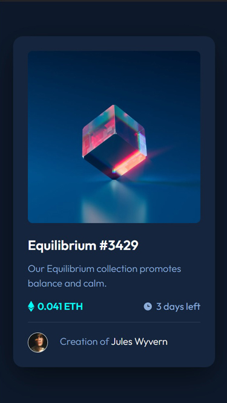

# Frontend Mentor - NFT preview card component solution

This is a solution to the [NFT preview card component challenge on Frontend Mentor](https://www.frontendmentor.io/challenges/nft-preview-card-component-SbdUL_w0U). Frontend Mentor challenges help you improve your coding skills by building realistic projects.

## Table of contents

- [Overview](#overview)
  - [The challenge](#the-challenge)
  - [Screenshot](#screenshot)
  - [Links](#links)
- [My process](#my-process)
  - [Built with](#built-with)
  - [What I learned](#what-i-learned)
  - [Continued development](#continued-development)
  - [Useful resources](#useful-resources)
- [Author](#author)
- [Acknowledgments](#acknowledgments)

## Overview

### The challenge

Users should be able to:

- View the optimal layout depending on their device's screen size
- See hover states for interactive elements

### Screenshot




### Links

- Solution URL: [Solution URL](https://your-solution-url.com)
- Live Site URL: [Live site URL](https://zp021-nft-preview-card-component.netlify.app)

## My process

### Built with

- Semantic HTML5 markup
- CSS custom properties
- Flexbox

### What I learned

I looked online for solutions on how to add the overlay layer to image on hover, and opted for a solution using adjacent sibling combinator.

```css
.container .image:hover .overlay {
    opacity: 0.6;
}

.container .image:hover .overlay + .view-icon {
    display: block;
}
```

### Continued development

Going forward, I would like to explore CSS more, focus on best practices, accessibility and responsivnes.

### Useful resources

- [Adjacent sibling combinator](https://developer.mozilla.org/en-US/docs/Web/CSS/Adjacent_sibling_combinator) - This helped me with the overlay layer.


## Author

- Frontend Mentor - [@zp021](https://www.frontendmentor.io/profile/zp021)
- GitHub - [@zp021](https://github.com/zp021)

## Acknowledgments

I very much enjoy doing these challenges. I tried to get the design as close as possible, and as the projects get more complex, I can see how having access to the design files would be helpful. Looking forward to the next challenge.


```
